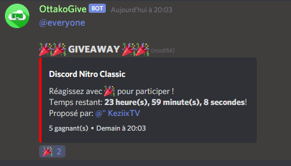
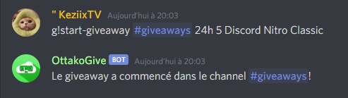

# Giveaways Bot

🎁OttakoGive utilise [discord-giveaways](https://npmjs.com/discord-giveaways) package.

## Features

* commande `start-giveaway`
* commande `reroll-giveaway`
* commande `end-giveaway`

</img>
</img>

## Install

* Configuration (config.json):
```json
{
    "token": "Your discord bot token",
    "prefix": "!",
    "everyoneMention": true,
    "hostedBy": true
}
```

* Installer les dépendances:
```sh
npm install
```

* Start:
```sh
node index.js
```
